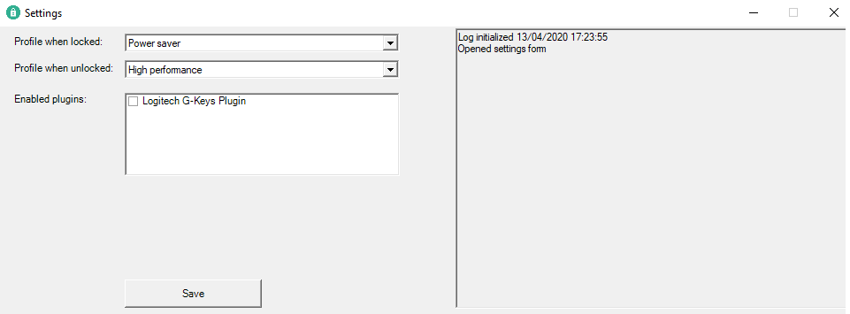

# Lock Unlock Power Profile

## Introduction
This application has been made since I was tired that my computer runs on a full powerplan when I'm away from my computer.

## Usage
When you launch the application, a tray icon will appear in your toolbar. 

You can double click the icon to open a setting menu and right click to either exit the application or to add the application to your windows startup.

## Plugins
You can write plugins for this application. The plugins must be written in .NET Framework from 4.0 or higher.

To write a plugin you need to add the application as a reference and just implement the interface IPlugin. 

There is an example project in the /Plugins folder. 

You need to place the compiled plugin (with dependency's) in the plugins folder inside the application folder.

The name should always be **LockUnlockPowerProfile.Plugins.**EXAMPLE otherwise the plugin will not be loaded.

## Icon
The application icon is used from https://www.iconfinder.com/iconsets/web-ui-color. Created by Julia Osadcha.